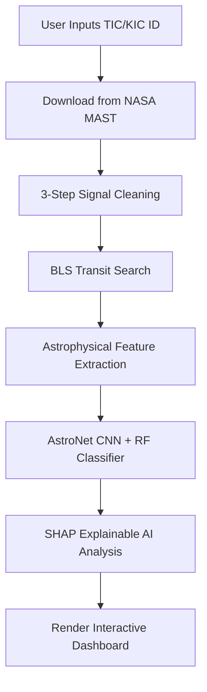
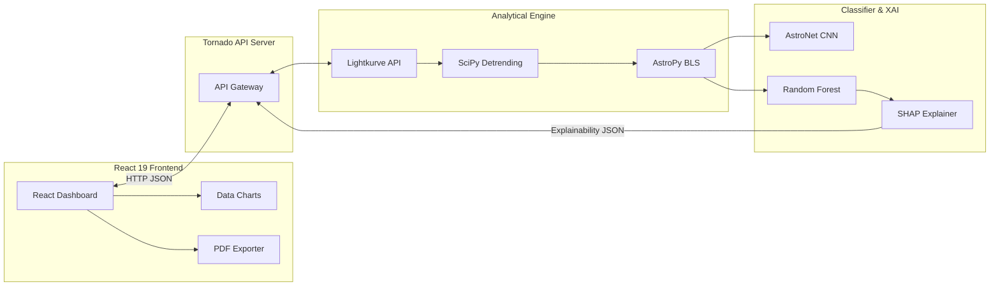

# EXOPLANET-HUNTERS: Visual-First PPT Outline

This deck is optimized to be **visually driven and minimal in text**, designed to be presented alongside screenshots of your working React frontend dashboard.

---

## Slide 1: The Opportunity

### **Vetting Exoplanets with Explainable AI**
*Subtitle: Bridging the gap between Machine Learning and Physics*

#### **[LEFT HALF - Text Content]**
* **The Problem:** Vetting exoplanets is a major data bottleneck. Traditional deep learning (AstroNet CNN) is a "black box" that fails silently when moving between space missions (Kepler to TESS).
* **The Solution:** A hybrid pipeline combining deep learning with **10 physical astrophysical parameters** (e.g., secondary eclipses, odd-even depth).
* **Our USP:** **Interpretability first.** A SHAP Explainable AI (XAI) layer that explains *why* the model made its decision, giving researchers immediate physical justification.

#### **[RIGHT HALF - Visual Placeholder]**
```
+--------------------------------------------------------+
|                                                        |
|    [ PLACE SCREENSHOT OF SEARCH & MAIN METRICS ROW ]   |
|  Showcases the clean, modern dark-mode dashboard with  |
|  key exoplanet properties (Period, Depth, Duration).   |
|                                                        |
+--------------------------------------------------------+
```

________________________________________________

## Slide 2: Core Features & User Experience

### **EXOPLANET-HUNTERS: End-to-End Vetting**

#### **[LEFT HALF - Text Content]**
* **MAST Integration:** Enter any KIC/TIC ID to fetch raw light curves instantly.
* **3-Stage Detrending:** Sigma-clipping, Running Median, and Savitzky-Golay filtering.
* **BLS Transit Search:** Automatically scans 20,000 potential periods.
* **Astrophysical Diagnostics:** Extracts 10 diagnostic metrics including shape score, symmetry, and secondary eclipse strengths.

#### **[RIGHT HALF - Visual Placeholder]**
```
+--------------------------------------------------------+
|                                                        |
|     [ PLACE SCREENSHOT OF DETRENDED & FOLDED PLOT ]    |
|  Shows the phase-folded light curve with clean, flat   |
|  baseline and clear transit dips from your frontend.   |
|                                                        |
+--------------------------------------------------------+
```

________________________________________________

## Slide 3: Process Flow

### **Pipeline Execution: Raw Data to Vetting Result**

#### **[LEFT HALF - Text Content]**
* **Automated Flow:** Executes the full 7-stage analytical pipeline in under 10 seconds.
* **Adaptive Scoring:** Calibrates CNN scores using a Sigmoid function for TESS targets to handle domain shift.
* **Clean Outputs:** Renders clear visual badge classifications (Green = Planet, Yellow = Binary/Blend, Red = Noise).

#### **[RIGHT HALF - Flow Diagram]**


________________________________________________

## Slide 4: Interactive Vetting Dashboard

### **Dashboard Visual Overview**

#### **[TOP ROW - Core Message]**
* *A single unified dashboard designed for professional exoplanet hunters, integrating raw physics, AI vetting, and model explanations.*

#### **[CENTER - Visual Mockup Placeholder]**
```
+-----------------------------------------------------------------------------------+
|                                                                                   |
|                   [ PLACE FULL-WIDTH DASHBOARD SCREENSHOT ]                       |
|   Capture the entire React application screen showing:                            |
|   1. Left side: Target metrics and significance meters.                            |
|   2. Right side: Multi-class probabilities and SHAP explainability chart.         |
|                                                                                   |
+-----------------------------------------------------------------------------------+
```

________________________________________________

## Slide 5: System Architecture

### **Modular Technical Architecture**



________________________________________________

## Slide 6: Technology Stack

### **Modern Scientific Tech Stack**

#### **[LEFT COLUMN - Backend & Physics]**
* **Data Sources:** Lightkurve API / NASA MAST Archive.
* **Physics & Analytics:** Astropy (BLS), SciPy (Savitzky-Golay filters), NumPy.
* **API Web Server:** Tornado (High-concurrency Python REST server).

#### **[RIGHT COLUMN - Machine Learning & Frontend]**
* **Machine Learning:** Scikit-Learn (Random Forest Classifier), TensorFlow 1.x (AstroNet CNN).
* **Explainability & Reports:** SHAP Explainer, ReportLab (Scientific PDF Generator).
* **Frontend:** React 19, TypeScript, TailwindCSS, Recharts.

________________________________________________

## Slide 7: Cost & Feasibility

### **Operational Cost & Scaling**

#### **[LEFT HALF - Text Content]**
* **Minimal Infrastructure:** No high-cost GPU nodes needed; model inference runs efficiently on standard CPUs.
* **Scale-friendly Design:** Serves static frontend via free tiers (Vercel) and lightweight containerized backend (AWS/Render).
* **Open Source Foundation:** Built entirely on open-source libraries (no software licensing fees).

#### **[RIGHT HALF - Cost Summary Table]**

| Category | Service | Development Cost | Production Scaling Cost |
|---|---|---|---|
| **Data Access** | NASA MAST API | $0.00 | $0.00 (Free public access) |
| **Hosting** | Vercel & Render | $0.00 | $7.00 - $35.00 / month |
| **Libraries** | TensorFlow, Sklearn | $0.00 | $0.00 (Open source) |
| **Total** | | **$0.00** | **$7.00 - $35.00 / month** |
